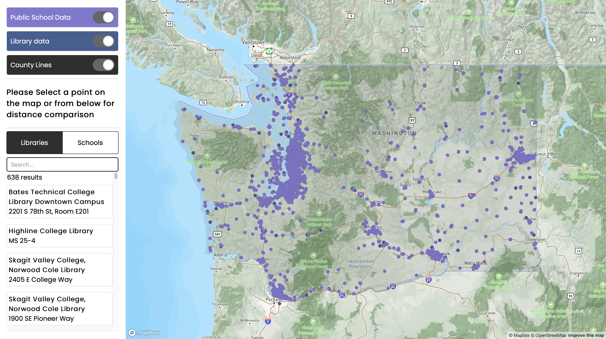

# Public Schools and Libraries Finder in Washington State
Contributors: Ethan Hubbartt, April Lee

### *Project title:*
Visualizing public schools and public libraries in Washington State

### *Project description:*
This web GIS application is designed to display a map that shows various locations of public schools and public libraries by county lines in Washington states using Mapbox GL JS, using 3 different layers: public schools(purple circle), public libraries(navy circle), and county(line). For the base map, we used our own map style which looks similar to the streets theme in mapbox, but we used a more vivid color scheme. Mainly this map allows users to select either library or school circle in the map and it will show the selected feature’s name and address information in the sidebar displaying a fixed buffer zone of 5 miles in the map. Then it will list the number of resulting libraries and schools with necessary information sorted by distance from the selected feature, and users can search either library or school name within the buffer zone. For your information, there are a total of 2,552 schools and 643 libraries in Washington state and each icon represents either school or library. Each location will show the location name with the county.

### *Project goal:*
Being accessible to libraries is important for public schools since it connects people to the information and resources they need. That being said, it creates an inclusive community and provides equal access to everyone, especially for people with disadvantaged backgrounds. That’s why we thought accessibility matters for all students and this map allows users to be able to locate all the public schools and public libraries in WA state as well as to see what school has the most or least accessibility to libraries. Then the goal of this project is to illustrate where some schools might have disadvantages based on how many public libraries are near them and may draw which county has the greatest access to libraries for students and vice versa. By doing so, this map can be useful for state legislators to devise some possible education-related policies for certain counties for better accessibility of education as well as people who want to see the nearest library based on their school. 

### *The application URL:*
https://ehubbartt.github.io/Washington-Library-and-School-Distances/

### *Screenshots:*
Initial application screen - all layers turned on

Only Library feature is turned on

5 miles of bufferzone of the selected feature.
In this case, we choose University of Wahsington's Engineering Library Building.
It lists total 82 results of libraries within the zone.

### *Main functions:*
The main function of this application allows users to either click on the circles to see either which school or library is located in the area, or they can use the sidebar to click through the specific feature they want to get more information on. Once a feature is selected, it will show the number of resulting features as well as listing other features(schools and libraries) that is within its buffer zone.

> **Build listings function  - updateDataList(features, type):** Build a list for each school and library to the side bar. It iterates through the libraries and schools name and address and adds each one to the sidebar listing dynamically. The listings will populate the sidebar on the left side of the page.
>
> **Interactivity functions - flyTo() & toggleLayer():** flyTo() center the map on the correct location and zoom in while toggleLayer() lets you toggle 3 different layers: schools, libraries, and county lines.
>

### *Data sources:*
The datasets come from [Washington Geospatial Open Data Portal](https://geo.wa.gov/), where it provides efficient, effective, and transparent datasets.
The datasets originally contain 2,552 records of public schools and 643 records of public libraries in Washington state with various download options including CSV, Shapefile, GeoJSON, and File Geodatabase.

### *Applied libraries and Web Services in use:*
The applied libraries used for this web GIS application are Mapbox GL JS, Mapbox Studio, and Mapbox Street Style for a base map and thematic map layers. The Web service used to publish our project publicly is through Github. We also used [Turf](https://turfjs.org) which is an advanced geospatial analysis for browsers, to create a buffer zone of 5 miles. 

### *Acknowledgment:*
- Bo Zhao: provided essential concepts needed to build web GIS application
- Steven Bao: helped debugging errors both technically and documentally
- [Washington Geospatial Open Data Portal](https://geo.wa.gov/): provided credible, transparent datasets
- [Mapbox](https://docs.mapbox.com/): provided a template as a reference

### *Extra information:*
We used [Build a store locator](https://docs.mapbox.com/help/tutorials/building-a-store-locator/#finished-product) as a reference. The series of tutorials teach you how to create a store locator using Mapbox GL JS then sort the stores by their distance from a given location using the Mapbox GL Geocoder plugin and TUrf.js. Basically it has two big parts: 1. Build a store locator 2. Sort stores by distance.
